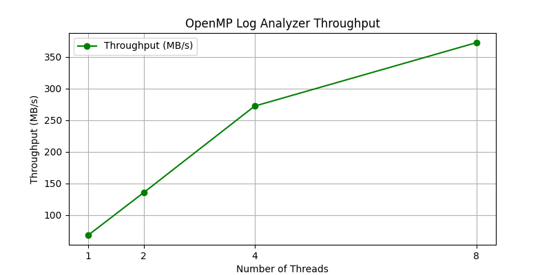
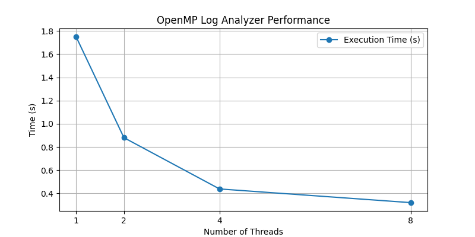

# OpenMP Log Analyzer


A **parallel log file analyzer** written in **C + OpenMP**.  
It counts different types of log messages (`ERROR`, `WARNING`, `INFO`, `DEBUG`) and shows **execution time** and **throughput** using multiple threads. Great for learning parallel programming and analyzing large log files efficiently.

---

## Features
- Reads `.log` files and counts message types.  
- Measures execution time and throughput (MB/s).  
- Uses OpenMP to scale with multiple threads.  

---

## Project Structure
```

openmp-log-analyzer/
├── src/        # C source code
├── data/       # Sample log files
├── bin/        # Compiled executables
├── Makefile    # Build script (optional)
└── README.md   # Project documentation

````

---

## Build & Run
### Using GCC directly:
```bash
gcc -O3 -fopenmp -std=c11 -Wall -Wextra -o bin/log_analyzer src/log_analyzer.c
./bin/log_analyzer data/sample.log
````

> On Windows, install **MSYS2 + mingw-w64-x86\_64-gcc**.
> On Linux/macOS, install **GCC with OpenMP**.

---

## Example Output

```
File: data/sample.log (0.00 MB), Lines: 6
Threads: 4
Counts -> ERROR: 2, WARNING: 1, INFO: 3, DEBUG: 0, OTHER: 0
Time: 0.000000 s | Throughput: 0.00 MB/s
```

---

## Performance Test

Tested with **119 MB log (5,000,000 lines)**:

```
File: data/big.log (119.21 MB), Lines: 5000000
Threads: 4
Counts -> ERROR: 0, WARNING: 0, INFO: 5000000, DEBUG: 0, OTHER: 0
Time: 0.438000 s | Throughput: 272.17 MB/s
```

Shows \~272 MB/s processing using 4 threads.

Here’s an example of the program output:



---

## Why This Project?

* Realistic log analysis example.
* Demonstrates **parallel programming** with OpenMP.
* Shows measurable **performance gains** for large files.

---

## Future Improvements

* Support for **custom log patterns** (regex).
* Real-time log monitoring (`tail -f` style).
* **Performance scaling graphs** (threads vs. throughput).
* Unit tests for different log formats.
---


